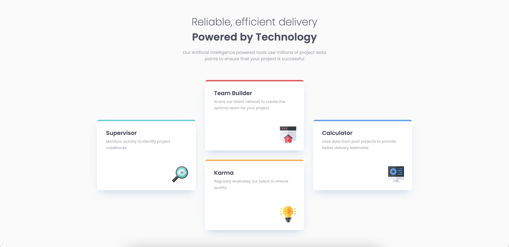

# Frontend Mentor - Four card feature section solution

This is a solution to the [Four card feature section challenge on Frontend Mentor](https://www.frontendmentor.io/challenges/four-card-feature-section-weK1eFYK). Frontend Mentor challenges help you improve your coding skills by building realistic projects.

## Table of contents

- [Overview](#overview)
  - [The challenge](#the-challenge)
  - [Screenshot](#screenshot)
  - [Links](#links)
- [My process](#my-process)
  - [Built with](#built-with)
  - [What I learned](#what-i-learned)
  - [Continued development](#continued-development)
  - [Useful resources](#useful-resources)
- [Author](#author)

## Overview

### The challenge

Users should be able to:

- View the optimal layout for the site depending on their device's screen size

### Screenshot

### Links

- Solution URL: [Frontend Mentor](https://www.frontendmentor.io/solutions/responsive-four-card-feature-section-with-bem-css-grid-and-flexbox-V-RSCz-uO)
- Live Site URL: [GitHub Pages](https://brendanmadden.github.io/four-card-feature-section/)

## My process

### Built with

- Semantic HTML5 markup
- CSS custom properties
- Flexbox
- CSS Grid
- Mobile-first workflow
- BEM

### What I learned

- I continued to learn and practice using BEM while working on this project and preparing for it
- I learned a lot more about responsive grid and flexbox layouts in preparation for and while working on this project
- I used a mobile-first workflow on this one, and I feel like I'm getting a better handle on this method

### Continued development

- Responsive layouts are still one of my top priorities. I want to find the most effective, efficient, elegant layouts to use that just seem to WORK
- I would like to continue to improve my HTML and project accessibility
- More advanced HTML and CSS concepts, organization, and layouts

### Useful resources

- [BEM](http://getbem.com/naming/) - The BEM docs helped me to understand how and why BEM is used. I really like it so far for organizing and structuring my CSS a little bit better.
- [Guide to Modern CSS Layouts](https://1linelayouts.glitch.me/) - This is an amazing resource on CSS Layouts with Flex and Grid.

## Author

- GitHub - [Brendan Madden](https://github.com/brendanmadden)
- Frontend Mentor - [@brendanmadden](https://www.frontendmentor.io/profile/brendanmadden)
- Twitter - [@BrendanMadden\_](https://www.twitter.com/BrendanMadden_)
